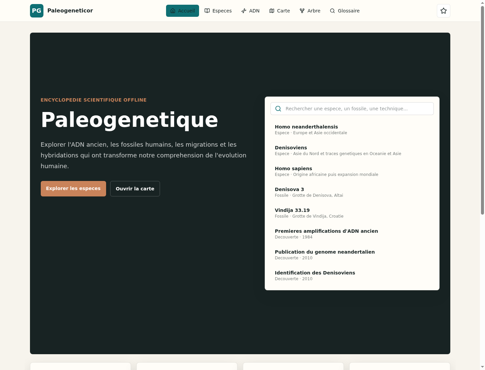
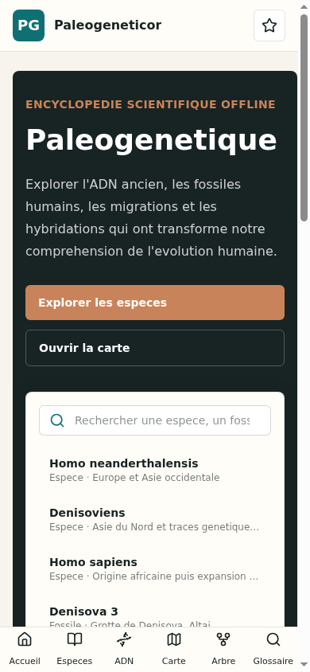
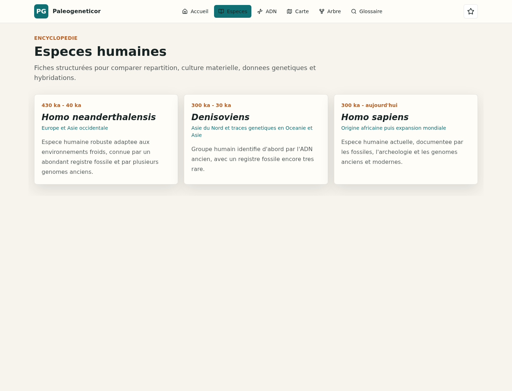
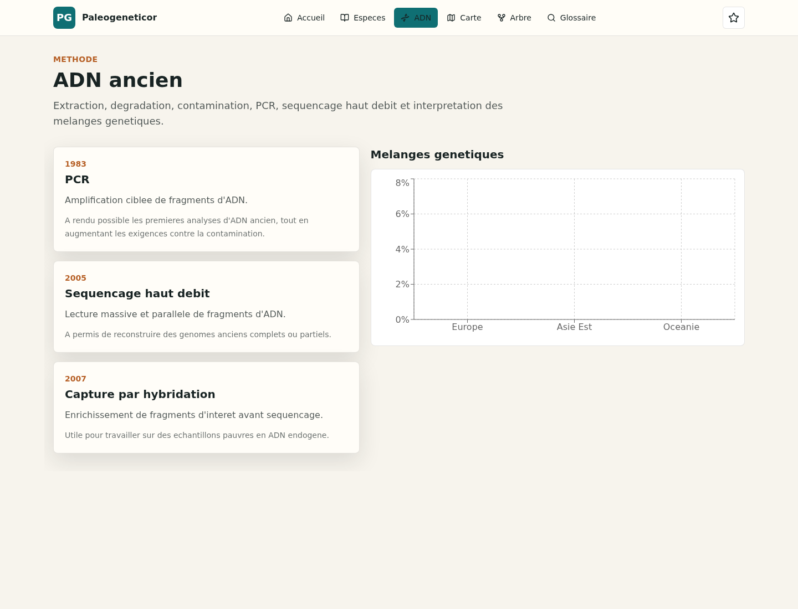

<p align="center">
  
</p>

<h1 align="center">Paleogeneticor</h1>

<p align="center">
  Encyclopedie PWA offline-first sur la paleogenetique, les especes humaines anciennes et l'ADN ancien.
</p>

<p align="center">
  
  
  
  
  
</p>

## Apercu

Paleogeneticor est une application educative concue pour le grand public, les etudiants et les enseignants. Elle combine fiches encyclopediques, recherche instantanee, visualisations scientifiques, favoris locaux et fonctionnement hors ligne apres installation.

<p align="center">
  
</p>

## Captures

| Accueil mobile | Especes humaines | ADN ancien |
| --- | --- | --- |
|  |  |  |

## Fonctionnalites

- Recherche globale instantanee avec Fuse.js dans les especes, fossiles, decouvertes, techniques et termes du glossaire.
- Fiches d'especes humaines avec periode, repartition, ADN, culture, outils et hybridations.
- Carte interactive Leaflet compatible offline-first, sans appel obligatoire a des tuiles externes.
- Arbre evolutif interactif avec ReactFlow.
- Graphiques de melanges genetiques avec Recharts.
- Favoris et historique conserves localement avec Dexie / IndexedDB.
- Chargement progressif des pages avec React Router et lazy loading.
- PWA installable sur Android avec manifest, icones et service worker Workbox.

## Stack

| Domaine | Technologies |
| --- | --- |
| Interface | React 19, TypeScript, Vite |
| Styles | TailwindCSS |
| Navigation | React Router |
| Etat local | Zustand |
| Stockage | Dexie, IndexedDB |
| Recherche | Fuse.js |
| Visualisations | Leaflet, ReactFlow, Recharts, D3.js |
| Animations | Framer Motion |
| PWA | vite-plugin-pwa, Workbox |
| Deploiement | Netlify |

## Installation

```bash
npm install
npm run dev
```

L'application locale est servie par defaut sur :

```text
http://localhost:5173/
```

## Scripts

```bash
npm run dev      # serveur de developpement
npm run build    # verification TypeScript et build production PWA
npm run preview  # preview locale du build
npm run test     # tests Vitest
npm run lint     # lint ESLint
```

## Structure

```text
src/
  components/       composants reutilisables
  pages/            ecrans routes charges en lazy loading
  layouts/          structure globale de l'application
  services/         contenu, recherche, IndexedDB
  store/            etat Zustand
  types/            modeles TypeScript
  data/             donnees JSON par domaine
public/
  icons/            icones PWA et application
  images/
    screenshots/    captures d'ecran documentaires
```

## Donnees

Toutes les donnees applicatives sont locales et stockees en JSON dans `src/data`. Le projet ne depend pas d'un backend. Chaque domaine peut etre enrichi progressivement avec de nouveaux fichiers ou collections JSON.

## PWA Android

Les assets d'installation sont disponibles dans `public/icons` :

- `app-icon.svg`
- `app-icon-192.png`
- `app-icon-512.png`

Le manifest est genere par `vite-plugin-pwa` depuis `vite.config.ts`. Le service worker precache les fichiers de build et les donnees JSON pour maintenir une experience offline apres installation.

## Documentation projet

- [CONTEXT.md](CONTEXT.md) : vision produit, principes techniques et conventions d'evolution.
- [CHANGELOG.md](CHANGELOG.md) : historique des versions.
- [PROMPT.md](PROMPT.md) : cahier des charges initial.
